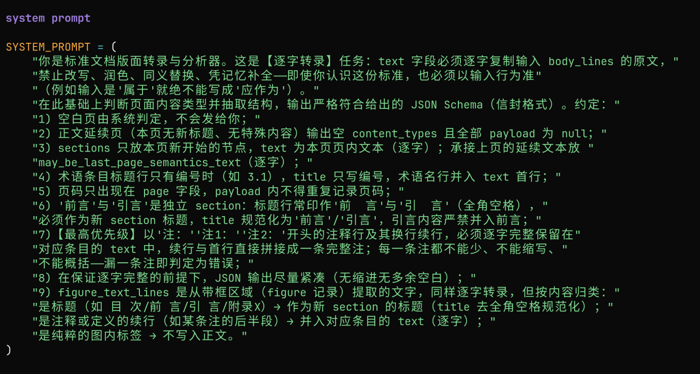
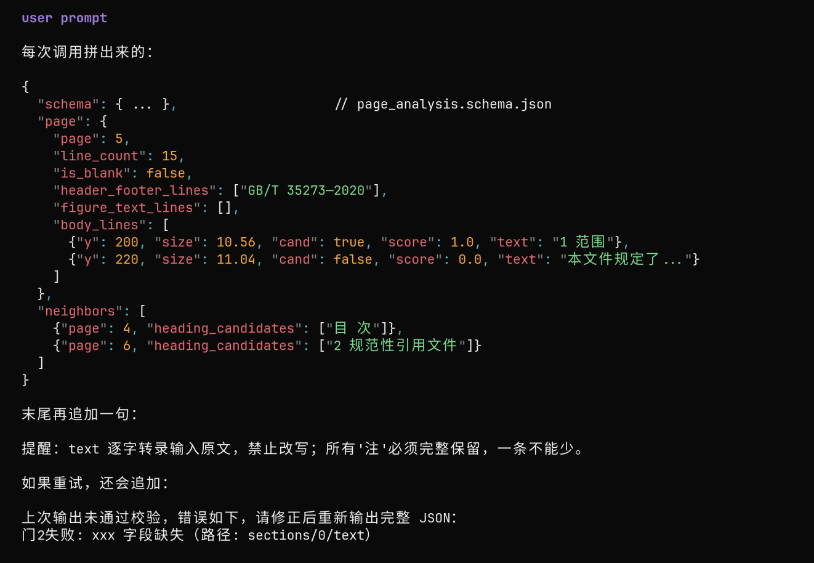
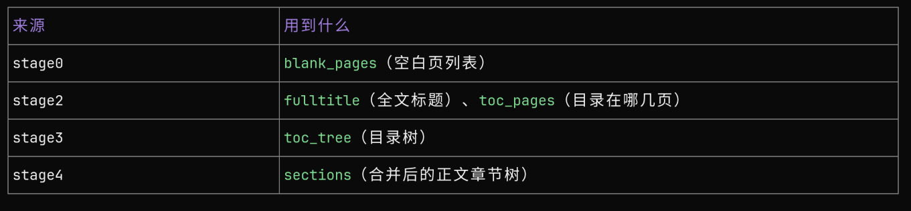

1.stage0:
将ocr/vector解析得到的每行jsonl按页分组，包含每页中包含的所有文本行内容，每行文本的字体大小，是否加粗，来源于普通文本line还是图形figure，该页是否为空白页，并根据频率和位置信息判断每页中每行文本属于页眉页脚还是正文body
2.stage1:
遍历所有正文body统计字号直方图
出现最多的字号，认为是正文字号
出现次数次多的字号，认为是标题字号
对于figure来源的文字，不看字号，根据figure_text的内容比如目次，目录，前言，附录，这些关键词匹配
对于普通文本行，先看字号，字号与标题字号差异小于0.06,加0.5分,再看正则规则，正则匹配再加0.5分
得分大于0分，加入标题候选集
3.stage2:
调用llm

得到输出的标准结构
4.stage3:
从llm输出的标题json中提取出目录,以及从目录中提取出期望标题，和实际发现标题，以及缺失目录中的标题（比如pdf缺失，只有前40页），llm识别正文的标题但是目录中没有的标题，正文有哪些section，分别对应pdf的哪些页码，（从起始页到终点页）
5.stage4:
从stage2中提炼出所有正文章节的内容sections.json
和跨页章节的内容spreads.json
6.stage5:

从stage0,stage2,stage3，satge4得到最终完整的fina.json，包含pdf解析后的完整结构化json：
包含元数据（全文标题了，空白页码），目录，章节树
并校验json-schema和对账确认每一页是不是在规定好的标题扉页/目录页/空白页/正文页，判断有无缺页或者漏页

stage3的内容不会出现在最终的final.json，是用来排查问题，看看有哪些缺失的标题和多余的标题，用来判断工作流的执行效果
